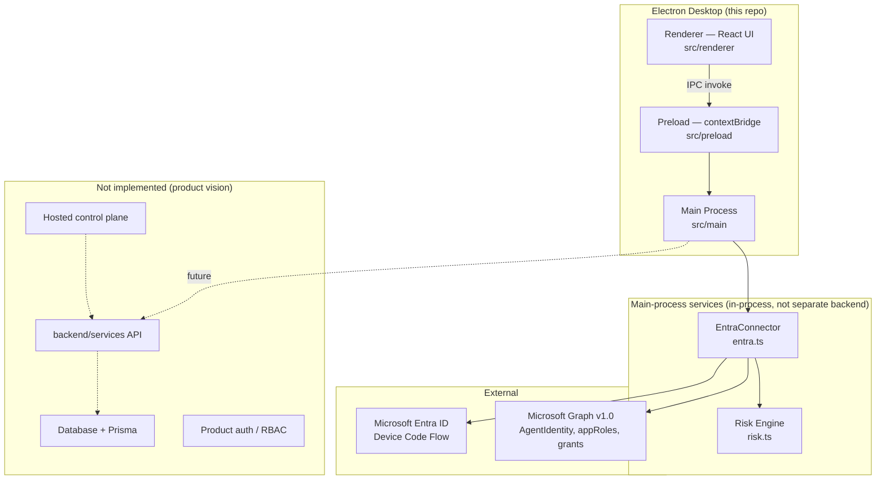

# Implementation Gap Analysis — Agent Security Platform (Pilot)

**Audit date:** 2026-08-17  
**Repository:** `agent-security-pilot` v0.1.0  
**Scope:** Production-readiness audit. No code changes performed.

---

## Executive Summary

This repository is an **Electron desktop pilot** (~17 source files) branded **Agent Security Pilot**. It implements a read-only Microsoft Entra connector, a deterministic risk engine, and an analyst UI with HTML report export. It does **not** yet contain the platform components described in the product brief (`backend/services`, `database`, Prisma, hosted control plane, customer management, or enterprise auth).

The pilot demonstrates the core analyst workflow conceptually—**discover → map permissions → score risk → show evidence**—but **cannot ship to production customers today** due to build/packaging defects, missing platform infrastructure, and absent enterprise operational controls.

---

## Issue Register

Issues are ranked **P0** (blocks shipping), **P1** (important for production), **P2** (later / hardening).

### 1. Build Errors

| ID | Priority | Issue | Evidence | Impact |
|----|----------|-------|----------|--------|
| B-01 | **P0** | `npm run build` uses `tsc -b` without a composite TypeScript project | `package.json` script `"build":"tsc -b && vite build"`; `tsconfig.json` has no `"composite": true` or `references` | Build mode (`-b`) requires composite projects; build likely fails with TS6377 |
| B-02 | **P0** | Main/preload emit ESM but Electron entry is loaded as CommonJS | `tsconfig.json` `"module":"ESNext"`; `package.json` has no `"type":"module"`; `"main":"dist/main/main.js"` | Packaged app likely throws `SyntaxError: Cannot use import statement outside a module` at startup |
| B-03 | **P0** | Vite renderer imports code outside its configured root | `vite.config.ts` `root:'src/renderer'`; `src/renderer/src/main.tsx` imports `../../shared/types` (outside root) | Vite 7 typically blocks or fails builds for out-of-root imports unless `server.fs.allow` / alias is configured |
| B-04 | **P1** | No working Electron dev workflow | `"dev":"vite"` only; no `electron`, `concurrently`, or `electron-vite` dev script | Developers cannot run the full app (main + preload + renderer) with one command |
| B-05 | **P1** | `npm run lint` references ESLint but ESLint is not installed or configured | `package.json` `"lint":"eslint ."`; no `eslint` dependency; no `eslint.config.*` | Lint script fails; no static analysis gate |
| B-06 | **P1** | Orphan root `index.html` vs canonical `src/renderer/index.html` | Two HTML entry files; Vite uses renderer copy only | Confusion; root file is dead weight |
| B-07 | **P2** | `risk.test.ts` compiled into production `dist/` | `tsconfig.json` `"include":["src"]` includes test file | Test artifacts packaged into installer unnecessarily |
| B-08 | **P2** | `@vitejs/plugin-react` listed as runtime dependency | `package.json` dependencies | Bloated production dependency tree for a desktop app |
| B-09 | **P2** | No lockfile committed (`package-lock.json` / `pnpm-lock.yaml`) | Absent from repository | Non-reproducible builds across machines and CI |

### 2. Type Errors

| ID | Priority | Issue | Evidence | Impact |
|----|----------|-------|----------|--------|
| T-01 | **P1** | Permissive `any` at IPC boundary | `preload.ts` `exportReport:(payload:any)`; `main.ts` `agents:any[]`; renderer `connectEntra` returns `Promise<any>` | Type safety ends at preload; runtime shape errors not caught at compile time |
| T-02 | **P1** | Renderer `Window.api` declares `openExternal` not exposed by preload | `main.tsx` global interface vs `preload.ts` actual API | Type declaration drift; future calls would fail at runtime |
| T-03 | **P2** | No separate tsconfigs for main/preload/renderer/test | Single `tsconfig.json` for all contexts | Electron main, DOM renderer, and Vitest have different type environments; harder to enforce strict boundaries |
| T-04 | **P2** | `zod` declared but unused | `package.json` dependency; no imports in source | Missed opportunity for IPC/env validation; dead dependency until wired |

*Note: Static review only—shell execution was unavailable during audit. Run `npm run typecheck` locally to confirm zero TS errors in current sources.*

### 3. Runtime Errors

| ID | Priority | Issue | Evidence | Impact |
|----|----------|-------|----------|--------|
| R-01 | **P0** | Packaged app likely non-startable | Combination of B-01, B-02, B-03 | Fresh install → app does not launch |
| R-02 | **P1** | Access token not refreshed during long sessions | `main.ts` stores token once; `discover` reuses without refresh | Graph calls fail after token expiry; user must reconnect manually |
| R-03 | **P1** | Graph sub-resource failures silently swallowed | `entra.ts` `.catch(()=>[])` on owners, grants, delegated, role resolution | Partial data presented as complete; false LOW risk possible |
| R-04 | **P1** | No global error handlers in main process | `main.ts` has no `process.on('uncaughtException')` / unhandledRejection | Crashes with no user-visible recovery |
| R-05 | **P1** | Sequential per-agent Graph fan-out | `entra.ts` loop with multiple `all()` calls per identity | Timeouts / UI freeze on tenants with many agents; no cancellation |
| R-06 | **P2** | No logout / token clear / connector reset | No IPC handler to clear `token` or `connector` | Stale session state; shared-machine risk |
| R-07 | **P2** | Device-code message may reference destroyed window | `win.webContents.send` in connect callback without destroyed check | Possible errors if window closed during auth |

### 4. Security Vulnerabilities

| ID | Priority | Issue | Evidence | Impact |
|----|----------|-------|----------|--------|
| S-01 | **P1** | No dependency vulnerability scanning in CI | No workflow files; no `npm audit` gate | Known CVEs in Electron/MSAL/npm tree may ship unnoticed |
| S-02 | **P1** | HTML report export uses string concatenation | `main.ts` `report:export` builds HTML with manual escaping | Escaping covers `&<>` but not quotes in attributes; low risk today but pattern is fragile |
| S-03 | **P1** | No SBOM generation | Absent | Supply-chain audit gap for enterprise customers |
| S-04 | **P2** | No SAST / secret scanning in CI | Absent | Client ID/token leakage in commits not automatically detected |
| S-05 | **P2** | No `.gitignore` | Absent from repository | Risk of committing `node_modules/`, `.env`, tokens, `dist/` |

### 5. Electron Security Issues

| ID | Priority | Issue | Evidence | Impact |
|----|----------|-------|----------|--------|
| E-01 | **P1** | No navigation / window-open hardening | `main.ts` creates BrowserWindow without `will-navigate`, `setWindowOpenHandler`, or `shell.openExternal` controls | Unexpected navigation or popup vectors if renderer compromised |
| E-02 | **P1** | CSP allows `'unsafe-inline'` styles | `main.ts` and `src/renderer/index.html` CSP | Reduces XSS mitigation margin (acceptable for pilot, not for hardened enterprise) |
| E-03 | **P2** | `electron` in `dependencies` not `devDependencies` | `package.json` | Larger attack surface in packaged dependency tree |
| E-04 | **P2** | No `webSecurity` / permission handler documentation | Defaults relied upon implicitly | Future feature work may accidentally weaken defaults |

**What is already good (baseline met):** `contextIsolation: true`, `nodeIntegration: false`, `sandbox: true`, credentials kept in main process, restrictive CSP skeleton, read-only Graph scopes.

### 6. Broken IPC Boundaries

| ID | Priority | Issue | Evidence | Impact |
|----|----------|-------|----------|--------|
| I-01 | **P1** | No input validation on `report:export` payload | `main.ts` accepts arbitrary `title` and `agents` shape | Malicious or malformed renderer data could cause export errors or unexpected file content |
| I-02 | **P1** | No IPC channel allowlist in preload | `preload.ts` exposes thin wrappers only (good) but no schema validation | Expanding API without discipline will widen attack surface |
| I-03 | **P2** | `entra:device-code` uses `webContents.send` (event) not invoke | Main → renderer push pattern | Acceptable for auth UX; listener cleanup relies on renderer calling returned unsubscribe |
| I-04 | **P2** | Shared types not enforced across boundary | `src/shared/types.ts` used in renderer and main but IPC payloads untyped at runtime | Contract drift between processes |

### 7. Missing Environment Configuration

| ID | Priority | Issue | Evidence | Impact |
|----|----------|-------|----------|--------|
| ENV-01 | **P0** | No `.env.example` or config module | Absent; client ID entered manually in UI | No documented env contract for CI, packaging, or tenant-specific settings |
| ENV-02 | **P1** | Hard-coded Entra authority `login.microsoftonline.com/common` | `entra.ts` constructor | Cannot target single-tenant / sovereign clouds / customer tenant ID without code change |
| ENV-03 | **P1** | Hard-coded Graph scopes and endpoints | `entra.ts` `scopes` array and URLs | Environment-specific consent and API versions not configurable |
| ENV-04 | **P2** | No runtime config for log level, feature flags, or telemetry opt-in | Absent | Operational tuning requires rebuild |

### 8. Missing Error Handling

| ID | Priority | Issue | Evidence | Impact |
|----|----------|-------|----------|--------|
| ERR-01 | **P1** | Graph errors truncated to 300 chars | `entra.ts` `throw Error(... t.slice(0,300))` | Hard to diagnose permission/consent failures |
| ERR-02 | **P1** | No retry/backoff for Graph 429/5xx | `entra.ts` single `fetch` per request | Flaky discovery on rate limits or transient outages |
| ERR-03 | **P1** | Renderer shows generic `e.message` only | `main.tsx` catch blocks | No error codes, remediation links, or support correlation IDs |
| ERR-04 | **P2** | No connector health-check IPC | Absent | Cannot verify Graph reachability before discover |

### 9. Missing Tests

| ID | Priority | Issue | Evidence | Impact |
|----|----------|-------|----------|--------|
| TEST-01 | **P0** | No E2E test for pilot acceptance path | README acceptance test described; no automated test | Cannot verify "fresh machine → install → connect → discover → export" in CI |
| TEST-02 | **P1** | Only 2 unit tests (risk engine) | `src/main/risk.test.ts` | Entra connector, IPC, report export, and UI untested |
| TEST-03 | **P1** | No Vitest config file | Absent | Test discovery, coverage thresholds, and environment not defined |
| TEST-04 | **P1** | No MSAL/Graph integration tests (mocked or recorded) | Absent | Regressions in permission mapping undetected |
| TEST-05 | **P2** | No component/UI tests for renderer | Absent | Dashboard regressions caught only manually |
| TEST-06 | **P2** | No security regression tests (CSP, preload surface) | Absent | Electron hardening can regress silently |

### 10. Missing Packaging Configuration

| ID | Priority | Issue | Evidence | Impact |
|----|----------|-------|----------|--------|
| PKG-01 | **P0** | Build pipeline broken (see B-01–B-03) | — | `electron-builder` has nothing valid to package |
| PKG-02 | **P1** | Minimal `electron-builder` config | `package.json` `"build"` block: `files:["dist/**"]` only | Missing icons, extraResources, asar options, file associations |
| PKG-03 | **P1** | No application icon for any OS | Absent `icon.ico` / `icon.icns` | Unprofessional installer; default Electron icon |
| PKG-04 | **P1** | No CI/CD release pipeline | No `.github/workflows` or equivalent | Manual, error-prone releases |
| PKG-05 | **P2** | No reproducible build / artifact signing attestation | Absent | Enterprise procurement blocker |

### 11. Missing Windows Installer Configuration

| ID | Priority | Issue | Evidence | Impact |
|----|----------|-------|----------|--------|
| WIN-01 | **P1** | NSIS target only, no customization | `"win":{"target":["nsis"]}` | No control over install dir, upgrades, per-machine vs per-user |
| WIN-02 | **P1** | No `publisherName`, no installer branding | Absent in build config | Windows SmartScreen warnings more likely |
| WIN-03 | **P2** | No ARM64 / MSI / MSIX targets | Absent | Limited deployment options for enterprise IT |
| WIN-04 | **P2** | No silent-install documentation or flags | Absent | IT cannot deploy at scale |

### 12. Missing Code-Signing Configuration

| ID | Priority | Issue | Evidence | Impact |
|----|----------|-------|----------|--------|
| SIGN-01 | **P0** | No code signing for Windows/macOS | No `certificateFile`, `cscLink`, Apple notarization settings | SmartScreen / Gatekeeper block; enterprise deployment failure |
| SIGN-02 | **P1** | No documented signing key custody process | `docs/PRODUCTION-GAPS.md` mentions requirement only | Operations team has no runbook |

### 13. Missing Update Configuration

| ID | Priority | Issue | Evidence | Impact |
|----|----------|-------|----------|--------|
| UPD-01 | **P0** | No auto-update mechanism | No `electron-updater`; no `publish` config in builder | Security fixes cannot be delivered post-ship |
| UPD-02 | **P1** | No update channel strategy (stable/beta) | Absent | Cannot stage rollouts |
| UPD-03 | **P2** | No downgrade / rollback policy | Absent | Broken update could brick analysts |

### 14. Missing Authentication

| ID | Priority | Issue | Evidence | Impact |
|----|----------|-------|----------|--------|
| AUTH-01 | **P0** | No product-level authentication (only Entra device-code for Graph) | App opens with no login gate | Anyone with the binary can attempt tenant connection |
| AUTH-02 | **P1** | Device-code flow only; no PKCE/confidential-client options for enterprise | `entra.ts` MSAL public client | Some enterprise IdP policies may restrict device code |
| AUTH-03 | **P1** | No token persistence strategy documented in code | `main.ts` in-memory token | Session lost on restart; no secure refresh persistence |
| AUTH-04 | **P2** | No SSO integration with corporate identity for the app itself | Absent | Analyst access not tied to customer IAM |

### 15. Missing Customer / User Management

| ID | Priority | Issue | Evidence | Impact |
|----|----------|-------|----------|--------|
| CUST-01 | **P0** | No multi-tenant customer model | Single-session desktop app | Cannot onboard or isolate customers |
| CUST-02 | **P0** | No RBAC (roles, permissions, audit of analyst actions) | Absent | Required for enterprise security product (`docs/PRODUCTION-GAPS.md` acknowledges) |
| CUST-03 | **P1** | No user directory / invite / license enforcement | Absent | No commercial or organizational control |
| CUST-04 | **P1** | No audit trail of analyst actions (connect, discover, export) | Absent | Compliance and forensics gap |
| CUST-05 | **P2** | No org/workspace switcher | Absent | MSP/consultant workflows unsupported |

### 16. Missing Microsoft Entra Integration Requirements

| ID | Priority | Issue | Evidence | Impact |
|----|----------|-------|----------|--------|
| ENTRA-01 | **P0** | No admin-consent / setup wizard in product | README steps external to app | High friction; misconfiguration in customer tenants |
| ENTRA-02 | **P1** | Delegated permission grants not human-readable | `entra.ts` delegated mapped as `resourceId:delegated:scope` | Reports incomplete vs app-role resolution (`docs/REAL-ENVIRONMENT.md` limitation) |
| ENTRA-03 | **P1** | No least-privilege verification tooling | Permissions documented in README only | Over-permissioned app registrations may pass review |
| ENTRA-04 | **P1** | No handling for Graph `$select` / API version drift | Hard-coded v1.0 URLs | API changes break discovery without version pinning strategy |
| ENTRA-05 | **P1** | `AgentIdentity` API availability not validated at connect time | Discover fails mid-run | Poor UX; unclear remediation |
| ENTRA-06 | **P2** | No support for sovereign clouds (GCC, China) | `login.microsoftonline.com/common` only | Government/regulated customers blocked |
| ENTRA-07 | **P2** | No connector health metrics | Absent | Ops cannot monitor integration status |

**What works:** Read-only Graph v1.0 connector skeleton, device-code auth, agent identity enumeration, partial appRole ID → name resolution, evidence snapshot collection in memory.

### 17. Data Persistence Problems

| ID | Priority | Issue | Evidence | Impact |
|----|----------|-------|----------|--------|
| DATA-01 | **P0** | No database layer (Prisma/PostgreSQL/SQLite absent) | No `prisma/`, no `backend/` | Discoveries, findings, and evidence lost on app close |
| DATA-02 | **P0** | No immutable evidence store | Evidence arrays live in memory; export is optional HTML | Cannot meet "evidence-backed" audit requirements over time |
| DATA-03 | **P1** | No migration strategy | Absent | Future schema changes will be painful |
| DATA-04 | **P1** | No data retention / deletion controls | `docs/PRODUCTION-GAPS.md` lists requirement | GDPR / customer DPA gap |
| DATA-05 | **P2** | No report history or versioning | Export overwrites user-chosen path only | No organizational record of assessments |

### 18. Secrets-Management Problems

| ID | Priority | Issue | Evidence | Impact |
|----|----------|-------|----------|--------|
| SEC-01 | **P1** | Access token stored in plain module-level variable | `main.ts` `let token=''` | Memory scraping; no OS keychain integration |
| SEC-02 | **P1** | No secure storage for refresh tokens if persistence added | Absent `safeStorage` / keytar pattern | Future feature could store secrets incorrectly |
| SEC-03 | **P1** | Client ID entered in renderer input field | `main.tsx` | Should come from secure config / MDM deployment params for enterprise |
| SEC-04 | **P2** | No secret rotation runbook | Absent | Operational gap for MSAL app registration rotation |
| SEC-05 | **P2** | No HSM/KMS story for hosted control plane | Platform not built yet | Future SaaS tier undefined |

---

## Current Architecture



### Process layout

| Layer | Path | Responsibility |
|-------|------|----------------|
| Renderer | `src/renderer/src/main.tsx` | Dashboard, connect/discover/export UX |
| Preload | `src/preload/preload.ts` | IPC bridge (`connectEntra`, `discover`, `exportReport`) |
| Main | `src/main/main.ts` | Window lifecycle, CSP, IPC handlers |
| Connector | `src/main/entra.ts` | MSAL auth + Graph pagination |
| Risk | `src/main/risk.ts` | Deterministic scoring + findings |
| Shared | `src/shared/types.ts` | Agent, Finding, Evidence types |

### Intended future state (from `docs/ARCHITECTURE-DECISION.md`)

Electron remains the analyst shell; discovery/risk logic should migrate to services to support a **hosted control plane**. That migration has **not started**—there is no `backend/`, `database/`, or Prisma schema.

---

## What Works

| Area | Status |
|------|--------|
| **Security baseline (Electron)** | Context isolation, sandbox, no node in renderer, CSP applied |
| **Product concept** | Clear MVP flow: connect → discover → risk → evidence → export |
| **Entra connector (design)** | Read-only Graph calls, pagination helper, partial role-name resolution |
| **Risk engine** | Deterministic, explainable findings with categories and recommendations |
| **Risk unit tests** | Two tests cover critical/high and low-risk scenarios |
| **Documentation** | Architecture decision, real-environment constraints, production gate list |
| **Report export** | HTML report with findings table and evidence appendix |
| **Packaging skeleton** | `electron-builder` with NSIS/DMG/AppImage targets declared |

---

## What Does Not Work (for Production)

| Area | Status |
|------|--------|
| **Build / packaging** | TypeScript build mode, ESM/CJS mismatch, Vite root boundary—likely prevent artifact generation and app startup |
| **Dev experience** | `npm run dev` does not launch Electron |
| **Platform backend** | No API, database, Prisma, or service layer |
| **Persistence** | All discovery and evidence is ephemeral |
| **Enterprise auth** | No product login, RBAC, or customer isolation |
| **Entra enterprise readiness** | No in-app setup, tenant targeting, retry, or health checks |
| **Distribution** | No code signing, auto-update, or CI release pipeline |
| **Operational security** | No audit trail, SBOM, dependency scanning, or crash reporting |
| **Test coverage** | No E2E; connector and IPC untested |
| **Lint / quality gates** | ESLint script non-functional |

---

## Recommended Implementation Order

Execute in phases. **Do not add new product features until Phase 1 is green.**

### Phase 1 — Make it build, run, and package (P0)

1. Fix TypeScript build: remove `-b` or add composite projects; emit **CommonJS** for main/preload (or enable ESM end-to-end with `"type":"module"` and Electron ESM entry).
2. Fix Vite config: add alias for `@shared` or move `src/shared` inside renderer root; verify `vite build` succeeds.
3. Add Electron dev script (`electron-vite`, or `concurrently` + `vite build --watch` + `electron .`).
4. Add `.gitignore`, lockfile, and `.env.example`.
5. Verify locally: `typecheck` → `test` → `build` → `package` → launch installer on clean VM.
6. Add minimal E2E smoke test (Playwright/Spectron) for app launch and window render.

### Phase 2 — Ship-safe desktop (P0–P1)

7. Configure Windows code signing + NSIS branding (`publisherName`, icon, install scope).
8. Add `electron-updater` + signed release feed + CI workflow (build, test, sign, publish).
9. Harden Electron: navigation handlers, window-open blocking, IPC payload validation with `zod`.
10. Implement token refresh in main process; add logout/clear-session IPC.
11. Add Graph retry/backoff; replace silent `.catch(()=>[])` with partial-failure reporting.
12. Add ESLint + Vitest config + expand unit tests for `entra.ts` (mocked fetch).

### Phase 3 — Data and evidence layer (P0 for platform)

13. Introduce local persistence (SQLite + Prisma recommended for desktop-first) for agents, findings, evidence snapshots.
14. Implement immutable evidence records with timestamps and source API version.
15. Add data retention/deletion settings.
16. Resolve delegated OAuth scopes to human-readable permission names.

### Phase 4 — Platform backend (P0 for SaaS / multi-customer)

17. Extract connector and risk engine into `backend/services` (shared package or HTTP API).
18. Add PostgreSQL + Prisma schema: tenants, customers, users, agents, assessments, evidence, audit events.
19. Implement product authentication (Entra ID SSO for analysts) separate from Graph connector credentials.
20. Implement RBAC and audit trail for all analyst actions.

### Phase 5 — Enterprise readiness (P1–P2)

21. In-app Entra setup wizard with admin-consent deep link and permission verification.
22. Customer/org management, licensing, multi-workspace support.
23. SBOM, dependency scanning, SAST, crash reporting (privacy-reviewed).
24. Penetration test remediation.
25. Sovereign cloud and single-tenant authority configuration.
26. MSI/MSIX, silent install docs, ARM64 builds.

---

## Relationship to Existing Docs

| Document | Role |
|----------|------|
| `docs/ARCHITECTURE-DECISION.md` | Electron shell + read-only baseline — **still accurate** |
| `docs/REAL-ENVIRONMENT.md` | Graph data model and permission caveats — **still accurate** |
| `docs/PRODUCTION-GAPS.md` | High-level gate checklist — **superseded in detail by this document** |

---

## Audit Limitations

- Shell execution returned no output during this audit. Build/runtime conclusions for B-01–B-03 and R-01 are based on **static analysis** of configuration and source. Run the verification commands in `README.md` locally and attach logs to confirm.
- The product brief references `backend/services`, `database`, and `Prisma`. Those directories **do not exist** in this repository; gaps are recorded as absent platform infrastructure, not as bugs in uncommitted code.

---

## Verification Checklist (for next engineer)

```powershell
cd C:\Users\danie\OneDrive\Desktop\S12
npm install
npm run typecheck
npm test
npm run build
npm run package
# Launch output installer on clean Windows VM
# Complete README acceptance test against a real Entra tenant
```

Expected outcome after Phase 1: all commands exit 0; installed app connects, discovers agents, shows risk, and exports HTML report.
